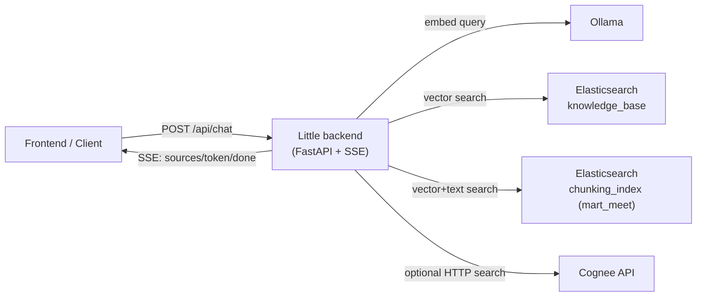

# Unified Project: Cross-linking of three systems

Единый проект объединяет 3 системы:

- `Little-main/backend` — центральный FastAPI backend для чата (`/api/chat`, SSE).
- `mart_meet` — Elasticsearch + индексы чанков (`chunking_index`) для поиска по документам.
- `cognee-main` — дополнительный движок знаний/поиска (опционально).

## 1. Архитектура и взаимодействие



Как это работает:

1. Клиент отправляет сообщение в `Little` backend (`POST /api/chat`).
2. Backend строит embedding запроса через Ollama.
3. Backend собирает документы из:
   - `knowledge_base` (legacy индекс),
   - `chunking_index` (индекс из `mart_meet`),
   - `cognee` (если включено `RAG_COGNEE_ENABLED=true`).
4. Backend объединяет результаты, формирует контекст и стримит ответ токенами через SSE.

## 2. Требования

- Docker Desktop (или Docker Engine + Compose).
- Запущенный Ollama (локально или удаленно).
- Windows PowerShell (для `run-unified.ps1`).

## 3. Быстрый запуск (рекомендуется)

Из корня проекта:

```powershell
Copy-Item .env.example .env
.\run-unified.ps1
```

Что запустится:

- `elasticsearch` на `http://localhost:9200`
- `rag-backend` на `http://localhost:8000`

Опции:

```powershell
# добавить Cognee API
.\run-unified.ps1 -WithCognee

# добавить Kibana
.\run-unified.ps1 -WithDebug
```

## 4. Ручной запуск через docker compose

```powershell
Copy-Item .env.example .env
docker compose up -d --build
```

С профилями:

```powershell
docker compose --profile cognee up -d --build
docker compose --profile debug up -d --build
```

## 5. Проверка после запуска

### Health check

```http
GET http://localhost:8000/api/health
```

Ожидается:

```json
{"status":"ok"}
```

### Тест чата (SSE)

```http
POST http://localhost:8000/api/chat
Content-Type: application/json

{
  "session_id": "test-session-1",
  "message": "Что ты знаешь по теме документа?"
}
```

События потока:

- `sources` — найденные источники
- `token` — фрагменты ответа
- `done` — завершение
- `error` — ошибка

Поведение ответов в прод-режиме:

- Если релевантные материалы не найдены, ответ формируется как обычный LLM-ответ и в конце добавляется явная пометка:
  `ответ сгенерирован без опоры на загруженные учебные материалы`.
- Если материалы найдены, в конце ответа добавляется блок `[Источники]` со ссылками на конкретные chunks:
  `/api/documents/source/{index_name}/{doc_id}`

### Единая загрузка документа (Elastic + Cognee)

Новый endpoint в `rag-backend`:

`POST /api/documents/upload` (multipart/form-data)

Параметры:

- `file` — файл (`txt`, `pdf`, `docx`)
- `dataset_name` — имя датасета в Cognee (по умолчанию `user_uploads`)
- `run_cognify` — запускать ли `cognify` после `add` (по умолчанию `true`)
- `chunk_size` — размер чанка (опционально)
- `chunk_overlap` — overlap чанков (опционально)

Пример:

```powershell
curl.exe -X POST "http://localhost:8000/api/documents/upload" `
  -F "file=@C:\path\to\document.pdf" `
  -F "dataset_name=user_docs" `
  -F "run_cognify=true"
```

Endpoint делает оба шага параллельно:

1. Чанки + эмбеддинги в Elasticsearch (`knowledge_base`)
2. `add` + `cognify` в Cognee

## 6. E2E проверка графовой памяти Cognee

1. Поднимите Cognee профиль:

```powershell
docker compose --profile cognee up -d --build
```

2. Запустите готовый smoke test:

```powershell
powershell -ExecutionPolicy Bypass -File .\smoke-test-cognee.ps1
```

Скрипт делает полный цикл:

- `add` документа в dataset,
- `cognify` для построения графа сущностей и связей,
- `search` с `GRAPH_COMPLETION` для проверки долгосрочной памяти.

## 7. Ключевые переменные окружения (`.env`)

Основные:

- `RAG_ELASTICSEARCH_URL` — адрес Elasticsearch.
- `RAG_ELASTICSEARCH_INDEX` — legacy индекс (`knowledge_base`).
- `RAG_ELASTICSEARCH_MART_INDEX` — индекс `mart_meet` (`chunking_index`).
- `RAG_OLLAMA_URL` — адрес Ollama.
- `RAG_OLLAMA_MODEL` — модель генерации.
- `RAG_OLLAMA_EMBED_MODEL` — модель эмбеддингов.

Флаги источников:

- `RAG_RAG_ENABLE_LEGACY_INDEX=true|false`
- `RAG_RAG_ENABLE_MART_INDEX=true|false`
- `RAG_COGNEE_ENABLED=true|false`

Cognee (если включен):

- `RAG_COGNEE_URL` (в docker-сети обычно `http://cognee-api:8000`)
- `RAG_COGNEE_SEARCH_TYPE` (например `CHUNKS`)
- `RAG_COGNEE_API_TOKEN` (если требуется авторизация)

Персистентность Cognee:

- База Cognee сохраняется на хосте в `./data/cognee/databases`
- Логи Cognee сохраняются в `./data/cognee/logs`

## 8. Где реализована склейка

- Агрегация поиска: `Little-main/backend/app/services/rag_service.py`
- Интеграция с Cognee: `Little-main/backend/app/services/cognee_service.py`
- Конфиг проекта: `Little-main/backend/app/config.py`
- Единый compose: `docker-compose.yml`

## 9. Типовые проблемы

- `docker engine not found` — Docker daemon не запущен.
- Пустой ответ в чате — проверьте доступность Ollama и корректность моделей.
- Нет документов из `mart_meet` — убедитесь, что индекс `chunking_index` существует в Elasticsearch.
- Нет результатов из Cognee — включите `RAG_COGNEE_ENABLED=true` и проверьте `RAG_COGNEE_URL`/токен.
- В `SSE token` ответ может приходить частями (по слогам/подстрокам) — это нормальный streaming-поведение.
